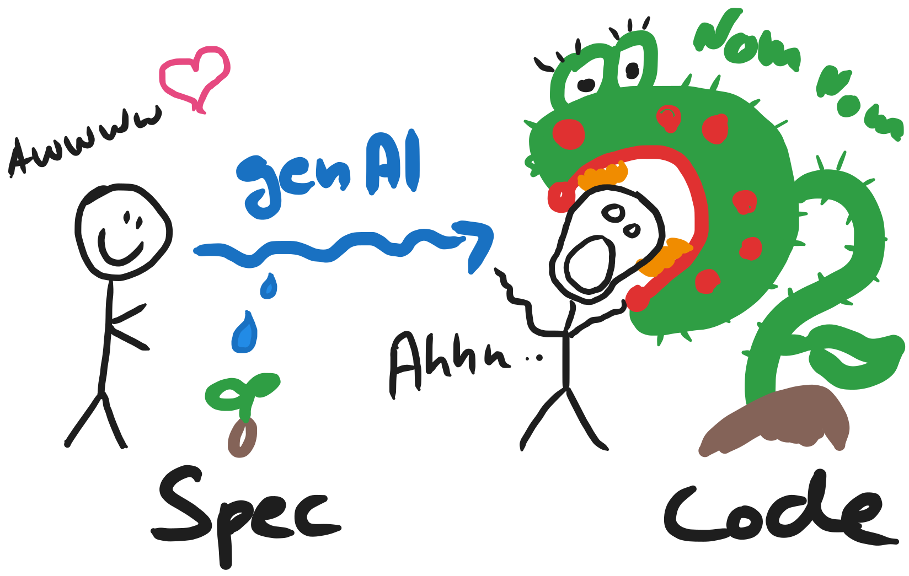
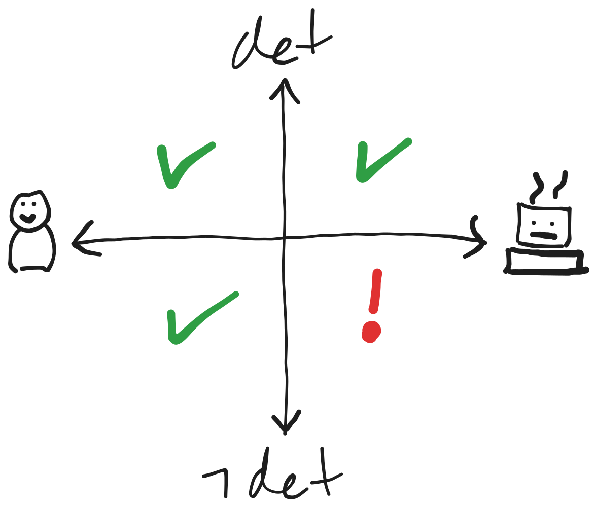
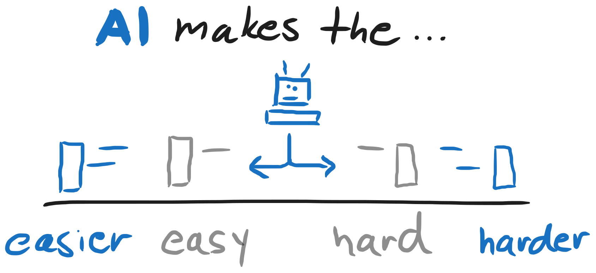

<!-- .slide: class="title-slide" -->

<div class="title-container">
  <div class="logos">
    
  </div>
  <h1 class="title">Agentic Engineering</h1>
  <span class="subtitle">Software Track, Part 1: Harness, Sandbox, Context, Spec, Scala</span>
  <span class="meta">HIVEMIND · half-day 1 of 2 · online</span>
</div>

---

## Nom nom



---

## Before we start

Run this now, before the first exercise:

```sh
git clone git@github.com:HivemindTechnologies/agentic-engineering-workshop-software
cd agentic-engineering-workshop-software
nix develop
just
```

---

## The new quadrants



---

## Three journeys

- **Non-determinism to determinism**:<br/>
A *prompt* gives a new program each time, a *spec* and a *check* pin it down
- **Local to team**:<br/>
A setup from one laptop, packaged, owned and used by everyone
- **Beyond traditional code**:<br/>
The agent past code generation

---

## Easy easier, hard harder



Writing code got cheap. Saying exactly what you want, and fixing the contracts between parts, costs what it always cost.

---

## How this works

- 💡 theory, 🛠️ you do it, 🏝️ journey lesson
- Every exercise runs in `agentic-engineering-workshop-software`
- The agent is `claude`
- Lessons build on each other

<!-- lessons: the menu, in order. `== <title>` opens a part (one half-day),
     `-- <title>` a block inside it, with its own divider slide.
     Every other line is one lesson id.
     Comment a line (leading #) to skip it.
     Safe to skip live, because no later lesson uses what they produce:
     files1, subagents1, mcp1, plugin1. plugin1 ends on
     a slide to show anyway.
== Part 1
-- Basics
harness1
sandbox1
-- Non-Determinism to Determinism
variance1
setup1
lesson-refine1
context1
skills1
lesson-refine1a
intent1
lesson-refine2
lesson-refine3
lesson-refine4
lesson-refine5
lesson-refine6
spec1
lesson-implement1
lesson-implement1b
lesson-implement2
qualitygates1
lesson-qualitygates1
lesson-refine7
lesson-qualitygates2
files1
lesson-skills1
lesson-skills2
hitl1
lesson-qualitygates3
lesson-qualitygates4
subagents1
-- Local to Team
mcp1
plugin1
-->

---

## Questions?

<!-- The agenda again: each lesson as the habit it replaces, struck through, and its replacement. -->
<div class="agenda journeys">
<div class="agenda-col"><p class="agenda-block">Basics</p><ul>
<li><s>Model</s> Harness</li>
<li><s>Approve</s> Sandbox</li>
</ul></div>
<div class="agenda-col"><p class="agenda-block">Non-Determinism to Determinism</p><ul>
<li><s>Short prompt</s> Interview</li>
<li><s>Weights</s> Context</li>
<li><s>Habit</s> Skill</li>
<li><s>Vague request</s> Plan</li>
<li><s>Chat</s> File</li>
<li><s>One window</s> Two</li>
</ul></div>
<div class="agenda-col"><p class="agenda-block">Local to Team</p><ul>
<li><s>Copy-paste</s> MCP</li>
<li><s>One laptop</s> Team</li>
</ul></div>
</div>
