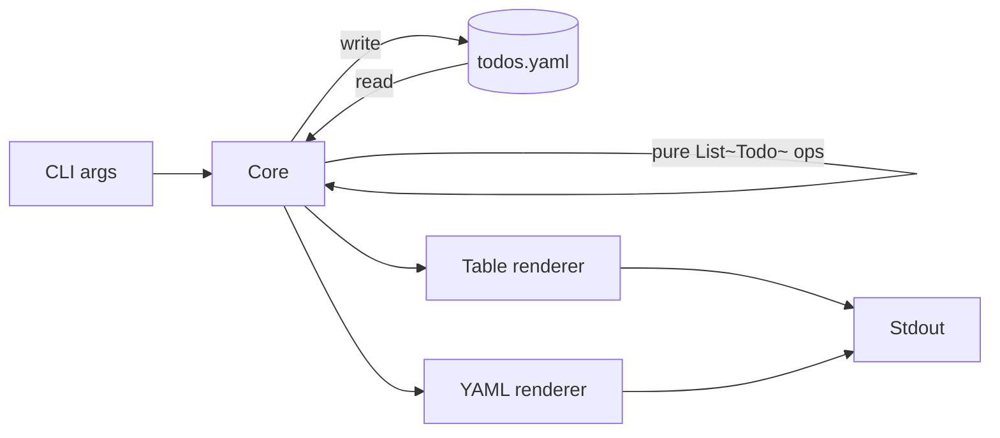

# 🏝️ Refine 7

**Rerefine the spec to add a scalafmt quality gate.** To showcase the ability to refine an existing and inflight SPEC add a scalafmt quality gate. It also demonstrates to change the ordering and number of milestones.

<!-- journey: refine-7 -->
<!-- backing-lesson: refine-7 -->
<!-- steckbrief:generated -->

**Last run**

- Minimum Runtime: 01:21
- Last Token Usage: 244.3k
- Results: `workshop/results/refine-7/2026-09-29-07-31-59`
- Material: `workshop/material/refine-7/`
- develop: `develop/`

<!-- hand:begin -->
<!-- Optional hand edits between these markers survive `presentation-bridge`
     unless you pass `--overwrite`. Keep slide separators (`----` / `---`)
     consistent with lessons/_template.md. -->
<!-- hand:end -->

----

## Refine 7

<div class="two-column">
<div class="column">

*PREPARE*

```sh
just prepare refine-7
just claude
```

</div>
<div class="column">

*WORKTREE*

```plaintext
.
├── .claude/
│   ├── commands/
│   ├── hooks/
│   └── settings.json
├── .githooks/
│   └── pre-commit
├── .github/
│   └── workflows/
├── docs/
│   ├── rules/
│   ├── specs/
│   └── PROMPTS.md
├── project/
│   ├── build.properties
│   └── plugins.sbt
├── src/
│   ├── main/
│   └── test/
├── .gitignore
├── .scalafmt.conf
├── build.sbt
├── CLAUDE.md
├── justfile
└── README.md
```

</div>
</div>

----

<!-- .slide: class="steckbrief-prompt-obs" -->

## Refine 7

*PROMPT TO TEST*

```plaintext
/refine @docs/specs/SPEC.v1-todo-list-cli-mvp.md insert a scalafmt
quality gate as pre commit hook as the new M4 and push the other
milestones down
```

*EXPECTED OBSERVATIONS*

- The SPEC should be updated with the new quality gate as inserted milestone M4
- The implemented milestones M1-M3 should stay where they were
- The old M4 is moved down to M5

----

<!-- showcase:from workshop/results/refine-7/EXPLANATION.md -->

## Results: Generated Spec

````plaintext
# SPEC v1 — Todo List CLI MVP

## Goal

A single-binary CLI todo list, grown milestone by milestone so `just check` is green from the first commit. Domain logic is a pure core over `List[Todo]`; Cats Effect sits at the edge for the filesystem and stdout. The store is one YAML file. The same data is reachable two ways directly from the CLI: a colored, aligned table for a human at a terminal, and raw YAML for a script or another tool.

## Scope

- One user, one machine, one YAML file as the store.
- Commands: `add`, `list`, `done`, `edit`, `remove`.
- Two renderers for `list`: a colored table (default) and YAML.
- A CI workflow that runs the same `just check` gate on every push and PR.

## Non-goals (later specs)

- A CLI-argument-parsing library — arguments are parsed by hand for now.
- Config files or environment-variable precedence for defaults.
- Filtering, sorting, priorities, due dates or tags.
- Any store other than a local YAML file (no SQLite, no remote/S3).

## Architecture sketch



The core (`Todo`, smart constructors, and the `add`/`done`/`edit`/`remove`
operations over `List[Todo]`) takes and returns values only. Reading the
YAML file, writing it back, deciding whether color is enabled, and printing
to stdout are the only things that touch `IO`.

## M1: Scala and sbt setup (Status: ✅ DONE)

Establish the build so `just check` is the one CI gate before any domain
code exists.

**Implementation Details:** `build.sbt` sets `scalaVersion := "3.3.4"` (the
current LTS) and adds `cats-core` 2.12.0, `cats-effect` 3.5.7, and, in
`Test` scope, `munit` 1.0.3, `munit-cats-effect` 2.0.0 and
`munit-scalacheck` 1.0.0, matching `docs/rules/WOW.md`. `scalacOptions`
includes `-deprecation`, `-feature`, `-unchecked` and `-Werror`.
`project/plugins.sbt` adds `sbt-scalafmt` 2.5.2 so `sbt scalafmtCheckAll`
is a real sbt task, and `project/build.properties` pins `sbt.version` to
1.10.7 (the nix-provided `sbt` binary is a self-updating launcher that
fetches this version on first run). `.scalafmt.conf` targets the
`scala3` dialect. `src/main/scala` and `src/test/scala` exist as the
source roots but are empty — there is no domain code yet, so `sbt
compile` has zero sources/warnings and `sbt test` collects zero tests,
both exiting 0. `.github/workflows/ci.yml` runs `just check` on `push`
and `pull_request` using `actions/setup-java`, `sbt/setup-sbt` and
`extractions/setup-just`. Verified locally: `just check`, `sbt compile`,
`sbt test` and `sbt scalafmtCheckAll` all exit 0 with zero warnings and
zero tests collected.

**Acceptance Criteria:**

- `build.sbt` targets Scala 3 and declares `cats-core`, `cats-effect`, and, in `Test` scope, `munit`, `munit-cats-effect` and `munit-scalacheck`, per `docs/rules/WOW.md`.
- `sbt compile` succeeds with `-Werror` in `scalacOptions` and zero warnings on a stock scaffold.
- `sbt test` exits 0 with zero tests collected (no test sources yet).
- A checked-in `.scalafmt.conf` makes `sbt scalafmtCheckAll` pass.
- `just check` runs scalafmt-check, compile and test in one invocation and exits 0 on a clean checkout.
- Sources live under `src/main/scala`, tests under `src/test/scala`.
- `.github/workflows/ci.yml` (or equivalent) runs `just check` on `push` and `pull_request`, so a red gate locally is red in CI.

## M2: Cats hello world (Status: IMPLEMENTED)

Prove the Cats Effect edge end to end before any domain logic.

**Implementation Details:** `todo.Main` extends `IOApp`; its `run` only
delegates to `todo.Cli.run`. `todo.Greeting.message` is the pure greeting
string, tested directly with no `IO`. `todo.Cli.greet(out: PrintStream): IO[Unit]`
is the effectful side — it takes the output stream as an explicit
parameter rather than writing to `System.out` directly, so the
`munit.CatsEffectSuite` test in `CliSuite` runs the real `IO`, captures
what it printed to a `ByteArrayOutputStream`-backed `PrintStream`, and
asserts on that, with no mocking and no global state. `Main` calls
`Cli.greet(System.out)` at the edge. With no arguments, `Cli.run` treats
the command as `Command.Greet`, so `sbt run` (no args) prints the
greeting and exits 0 — the M3 subcommands (`add`, `list`) are added
alongside it, and any other input reports "Unknown command" and exits
non-zero.

**Acceptance Criteria:**

- The entry point extends `IOApp` (or `IOApp.Simple`) — no `App`, no top-level `main` running side effects directly.
- `sbt run` prints a greeting to stdout and exits 0.
- The greeting text comes from a pure function with no `IO` in its signature; a test calls it directly and asserts on the returned string, no I/O involved.
- A `munit.CatsEffectSuite` test runs the `IO` that prints the greeting and asserts on its result.

## M3: Create and read todos (Status: IMPLEMENTED)

The pure domain model and the YAML-backed store, with `add` and `list`.

**Implementation Details:** `todo.core.Title` is an opaque type over
`String`; its only constructor, `Title.apply`, returns
`Either[Title.Error, Title]` and rejects a blank or whitespace-only raw
string without ever trimming it into a silently-accepted empty value.
`todo.core.TodoId` is an opaque `Int`. `todo.core.Todo` is a plain case
class of `(TodoId, Title, Boolean)` — it needs no smart constructor of
its own because both of its interesting fields are already
valid-by-construction. `todo.core.Todos.add` is the pure operation:
given the existing list and a raw title, it validates the title, picks
the next id as one past the current maximum (or `1` for an empty list),
and returns `Either[Todos.Error, (Todo, List[Todo])]` — the created
`Todo` and the appended list — with no `IO` in its signature.

The store uses `org.virtuslab:scala-yaml` (a dependency-free, Scala-3-native
YAML library) added to `build.sbt`. Rather than deriving a codec for
`Todo` directly — which would let the library's `Mirror`-based derivation
construct a `Todo` straight through `fromProduct`, bypassing `Title`'s
smart constructor entirely — `todo.store.TodoRecord` is a separate,
private wire-format case class (`id: Int, title: String, done: Boolean
derives YamlCodec`). `todo.store.Store.read`/`write` take the file `Path`
as an explicit parameter (no global path) and convert between
`TodoRecord` and the domain `Todo`, so a record with a blank title read
from disk still fails through `Title.apply` rather than silently
producing an invalid `Todo`. `read` checks existence first and returns
`Right(Nil)` for a missing file without touching the filesystem further;
a present file is parsed with `.as[List[TodoRecord]]`, and both a
`YamlError` (malformed syntax/shape) and an invalid record surface as a
`StoreError` with a human-readable `.message` — never a partial result,
never a raw stack trace. One real bug surfaced by writing the round-trip
test *before* the fix (per the TDD requirement): `org.virtuslab::scala-yaml` renders an
empty `Seq` as the empty string, which then fails to reparse
(`ComposerError: Expected YAML node, but found: StreamEnd`); `write`
special-cases an empty todo list to the literal `"[]
"` so an emptied
store still round-trips.

`todo.render.Renderer.renderList: List[Todo] => String` is the M3 plain
listing (`No todos yet.` when empty, one `#<id> [pending|done] <title>`
line per todo otherwise) — a pure function with no `IO`, which M5 will
replace with a table.

`todo.Cli` wires it together: `Cli.run(args, storePath, out)` takes the
store path and output stream as explicit parameters (`Main` supplies the
real `todos.yaml` in the working directory and `System.out`; tests
supply a temp file and a captured stream), so the CLI is exercised
end-to-end with a real fixture file and no process spawn or mocking.
`add` reads the store, calls `Todos.add`, and only writes back on
success; a blank title never reaches `Store.write`, leaving the store
untouched, and exits with `ExitCode.Error` naming the problem. A
successful `add` writes the updated list and prints
`Added todo #<id>: <title>`. `list` reads the store and prints
`Renderer.renderList`.

**Acceptance Criteria:**

- `Todo` holds an id, a non-empty title and a `done` flag; the title's smart constructor returns `Either[<error>, Todo]` for a blank or whitespace-only title — never throws, never silently trims to empty.
- The store's read and write functions take the YAML file path as an explicit parameter — no hardcoded global path — so tests read and write a real temp file with no mocking.
- Reading a store path that does not exist yields an empty todo list, not an error.
- Writing a list of todos to the store and reading it back yields an equal list (round-trip test).
- Reading a malformed YAML store file fails fast with a descriptive error on the `IO`/`Either` error channel, not a partial result or a raw
  stack trace.
- `todo add "<title>"` appends one `Todo` with `done = false` to the store and prints confirmation naming the new id.
- `todo add ""` (or an all-whitespace title) leaves the store untouched, exits non-zero, and names the problem.
- `todo list` on an empty store prints a "no todos" message and exits 0.
- `todo list` after two `add`s prints both todos, each with its id, title and done state.

## M4: Scalafmt pre-commit gate (Status: PENDING)

Catch formatting drift before it lands, not just in CI — a commit whose diff would fail scalafmt's check never reaches the repo.

**Acceptance Criteria:**

- A versioned git hook (e.g. `.githooks/pre-commit`) runs `sbt scalafmtCheckAll` (directly, or via `just check`) and exits non-zero on any formatting violation.
- `just install-hooks` sets `core.hooksPath` to the versioned hooks directory and makes the hook executable, so a clean clone gets the gate after running it once with no other setup.
- Staging a file with a deliberate formatting violation and attempting to commit is rejected by the hook, and no commit is created (verified by inspecting the git log before/after).
- Running `just fmt` (or `sbt scalafmtAll`) to fix the violation and re-attempting the commit succeeds.
- Running the hook directly (not just through `git commit`) exits 0 on an already-formatted tree, so it is testable without mutating history.

## M5: List as table (Status: PENDING)

Turn the plain listing from M3 into an aligned table.

**Acceptance Criteria:**

- `todo list` output starts with a header row naming the columns, then one row per todo.
- Columns stay aligned when values differ in width (a 1-digit vs 3-digit id, a short vs long title) — checked by asserting on the rendered string.
- The done/pending state renders as a distinct marker per row (e.g. `[x]`/`[ ]`), not a raw boolean.
- The empty-store case still renders the M3 "no todos" message, not a header with zero rows.
- The renderer is a pure function `List[Todo] => String`, tested directly with no I/O.

## M6: Updates (Status: PENDING)

Mark todos done, edit their title, and remove them.

**Acceptance Criteria:**

- `todo done <id>` sets that todo's `done` flag and persists it; a subsequent `todo list` shows it as done.
- `todo done <id>` on an already-done todo is an idempotent no-op that still exits 0.
- `todo edit <id> "<title>"` replaces that todo's title under the same non-empty validation as `add`, and persists the change.
- `todo remove <id>` deletes that todo; a subsequent `todo list` no longer shows it.
- `done`, `edit` and `remove` given an id absent from the store each exit non-zero, name the unknown id, and leave the store unchanged (verified by reading the store before and after).
- Each operation is backed by a pure function over `List[Todo]` (`(List[Todo], ...) => Either[<error>, List[Todo]]`) tested without touching the filesystem; the CLI layer only wires that function to the store read/write.

## M7: Add colors (Status: PENDING)

Colorize the table without breaking non-terminal output.

**Acceptance Criteria:**

- On a color-capable terminal, done and pending rows render with visibly different ANSI colors in the output string.
- Setting `NO_COLOR` (per no-color.org) suppresses all ANSI codes — asserted by checking the rendered string contains no escape sequences.
- When stdout is not a TTY (e.g. piped to a file), ANSI codes are suppressed by default, same as the `NO_COLOR` case.
- The color-enabled decision is a pure function of an explicit boolean computed once at the edge (from env and TTY check) — the coloring function itself is tested by passing `true`/`false` directly, no real terminal or env mutation needed.
- The M5 column-alignment tests still pass with color disabled: stripping ANSI codes from a colored row yields the same text as the uncolored row.

## M8: Add YAML output and a switch argument (Status: PENDING)

Let `list` render as YAML in addition to the colored table, selected by an explicit flag.

**Acceptance Criteria:**

- `todo list` and `todo list --output=table` both render the M7 colored table; `table` is the default when the flag is omitted.
- `todo list --output=yaml` renders the current todos as YAML using the same schema as the store file, such that feeding that output back through the store's YAML reader reconstructs an equal list of todos.
- `todo list --output=<anything else>` fails fast before rendering: a non-zero exit and a message naming the invalid value and the valid choices.
- The YAML renderer is a pure function `List[Todo] => String`, covered by a round-trip test independent of the table renderer.
- Empty-store output stays renderer-specific: `--output=table` still prints the "no todos" message; `--output=yaml` prints an empty YAML list (e.g. `[]`), not the human-readable message.
````
