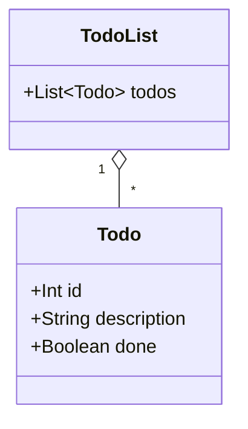

# SPEC v1: Todo List CLI MVP

A command-line todo list. Scala 3, pure functional core, Cats Effect at the edge, one YAML file as the store. Ways of working are set in `docs/rules/WOW.md` and apply to every milestone below.

## Scope

- Commands: `add`, `list`, `done`, `remove`. No other commands in this spec.
- Store: a single file, `todo.yaml`, in the current working directory. No database, no config file, no alternate path.
- Output: plain text only — no color/ANSI codes, no table formatting, no Markdown syntax.
- Gate: `just check` (scalafmt check, compile with `-Werror`, test) is the pass/fail bar for every milestone. It must stay green after each commit.
- The CI workflow file that runs `just check` lands with M1, the first code milestone.

## Domain shape (for reference, not binding syntax)



- `id` is a positive integer, assigned in creation order starting at 1, never reused after a `remove`.
- `todo.yaml` holds a single `todos:` sequence of `{id, description, done}` entries.

## M1: Scala and sbt setup (Status: PENDING)

An empty, buildable Scala 3 project. No application code yet — this milestone proves the toolchain and the CI gate.

**Acceptance Criteria:**
- `sbt compile` succeeds on a clean checkout with `scalaVersion` set to a Scala 3.x release.
- `build.sbt` sets `-Werror` (and `-deprecation`, `-unchecked`) in `scalacOptions`, so a warning fails compilation.
- `.scalafmt.conf` exists and targets Scala 3 (`runner.dialect = scala3`); `sbt scalafmtCheckAll` passes on a freshly formatted tree.
- `sbt test` succeeds with zero tests (a `munit`, `munit-cats-effect`, and `munit-scalacheck` dependency is declared in `build.sbt`, per `WOW.md`).
- `just check` exits 0 on a clean checkout.
- A GitHub Actions workflow file (e.g. `.github/workflows/ci.yml`) runs `just check` on push and on pull request; the file is committed as part of this milestone.

## M2: Cats hello world (Status: PENDING)

A minimal `IOApp` entry point, proving Cats Effect plumbing before any todo logic exists.

**Acceptance Criteria:**
- `build.sbt` declares `cats-core` and `cats-effect` dependencies.
- The program's entry point extends `IOApp` (or `IOApp.Simple`) and runs its effect as `IO`, not by calling `unsafeRunSync` outside the CE runtime.
- Running the built program with no arguments prints a fixed greeting line to stdout and exits with code 0.
- A `munit-cats-effect` test runs the program's `IO` action and asserts on its captured output, without touching real stdin/stdout of the test process (capture the effect's result value, not the console).
- `just check` stays green.

## M3: create and read todos (Status: PENDING)

`add` and `list`, backed by `todo.yaml`. The domain (id assignment, YAML encode/decode, todo construction) is pure and unit-tested without filesystem access; only the CLI's outermost layer touches `IO`.

**Acceptance Criteria:**
- `add "buy milk"` when `todo.yaml` does not exist creates it, containing one todo with `id: 1`, `description: "buy milk"`, `done: false`.
- A second `add "walk dog"` appends a todo with `id: 2`, leaving the first todo unchanged.
- `add ""` (empty or whitespace-only description) exits with a non-zero code, prints an error naming the `description` field, and leaves `todo.yaml` untouched (or uncreated, if it did not already exist).
- `list` when `todo.yaml` does not exist prints exactly `no todos` and exits 0.
- `list` after the two adds above prints exactly:
  ```
  1 pending buy milk
  2 pending walk dog
  ```
  one todo per line, in insertion order, each formatted as `<id> <status> <description>` with single spaces and no other characters — no ANSI color codes, no box/column drawing, no Markdown syntax (`*`, `#`, `` ` ``, `|`, `[ ]`).
- The pure encode/decode functions round-trip: encoding a list of `Todo` values to YAML and decoding the result returns the original list, checked with a `munit-scalacheck` property test.
- The pure id-assignment function is unit-tested directly (given an existing todo list, the next id is one greater than the current maximum, or 1 for an empty list), with no file I/O in the test.

## M4: updates (Status: PENDING)

`done` and `remove`, completing the MVP command set.

**Acceptance Criteria:**
- `done <id>` for an existing id sets that todo's `done` field to `true` in `todo.yaml`, leaving every other todo's fields unchanged; a following `list` shows that row as `done` instead of `pending`.
- `done <id>` for an id already marked `done` succeeds (exit 0), and `todo.yaml` content is unchanged.
- `done <id>` for an id not present in `todo.yaml` exits with a non-zero code, prints an error naming the missing id, and leaves `todo.yaml` unchanged.
- `remove <id>` for an existing id deletes that entry from `todo.yaml`; a following `list` no longer shows it, and the remaining todos keep their original ids (no re-numbering).
- `remove <id>` for an id not present in `todo.yaml` exits with a non-zero code, prints an error naming the missing id, and leaves `todo.yaml` unchanged.
- The pure functions backing `done` and `remove` (find-and-update, find-and-delete over a `List[Todo]`) are unit-tested directly against in-memory lists, independent of YAML or file I/O.
- `just check` stays green.
