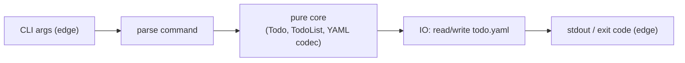

# Todo List CLI — MVP

A command-line todo list in Scala 3: `add`, `list`, `done`, `remove`, backed by a single `todo.yaml` in the current directory. Ways of working: `docs/rules/WOW.md`.

## Scope

- Commands: `add <text>`, `list`, `done <id>`, `remove <id>`. No other commands in this spec.
- Store: one file, `todo.yaml`, in the current directory. No database, no config file, no second store.
- Output: plain text only. No color, no table drawing, no Markdown.
- Failure: expected failures (bad input, missing id, malformed store) surface as `Option`/`Either` in the core and as a non-zero exit with a plain-text message at the edge — never a thrown exception.
- Stack: Scala 3, sbt, Cats, Cats Effect, munit (`munit-cats-effect` for `IO`, `munit-scalacheck` for properties).
- Gate: `just check` (scalafmt, compile with `-Werror`, test) is the one command that must pass. A GitHub Actions workflow runs it on push and pull request; the workflow file lands in M1, the first code milestone.

## M1: Scala and sbt setup (Status: PENDING)

Establish the build so the project compiles, tests, and formats before any domain code exists. The GitHub Actions workflow that runs `just check` lands here, so every later milestone is checked automatically from this point on.

**Acceptance Criteria:**
- `sbt compile` succeeds on Scala 3 with no source beyond a placeholder `Main`.
- `sbt test` exits 0 with munit, `munit-cats-effect`, and `munit-scalacheck` resolved on the test classpath (zero tests is a pass).
- `sbt scalafmtAll` runs without error and leaves the tree unchanged on a second run.
- `just check` runs scalafmt-check, compile with `-Werror`, and test, and exits 0.
- A GitHub Actions workflow file runs `just check` on `push` and `pull_request`.

## M2: Cats hello world (Status: PENDING)

Prove the Cats Effect runtime wiring before any domain logic exists.

**Acceptance Criteria:**
- The entry point is an `IOApp` (or `IOApp.Simple`); the program's output is produced by evaluating an `IO` value, not by a bare `println` in `main`.
- Running the built CLI with no arguments prints a fixed greeting line to stdout and exits with code 0.
- A test evaluates the `IO` that produces the greeting and asserts on its result, without shelling out to a built binary.

## M3: Create and read todos (Status: PENDING)

Implement `add` and `list`, and the `todo.yaml` store they share. This milestone fixes the shape of a todo and its YAML encoding for the rest of the spec.

**Acceptance Criteria:**
- `add "<text>"` appends a new todo with a freshly assigned id and `done = false` to `todo.yaml`, creating the file if it does not exist.
- `add` with empty or whitespace-only text is rejected, `todo.yaml` is left unchanged, and the CLI reports the reason on stderr with a non-zero exit — no exception.
- Ids assigned by `add` are stable and never reused, even across separate CLI invocations.
- `list` when `todo.yaml` does not exist prints no todos and exits 0 — an empty list is not an error.
- `list` prints one line per todo (id, text, done state), in the order they were added, as plain text — no color, no table, no Markdown.
- A core function decodes `todo.yaml` content into the list of todos and returns `Left`/`None` on a shape it does not recognise, rather than throwing.
- The function that computes "the list after an add" takes and returns plain values (no `IO`) and is tested without touching the filesystem.

## M4: Updates (Status: PENDING)

Implement `done` and `remove`, the two commands that change an existing todo by id.

**Acceptance Criteria:**
- `done <id>` sets that todo's done state to true in `todo.yaml` and leaves every other todo, and its id, unchanged.
- `remove <id>` deletes that todo from `todo.yaml` and leaves every other todo, and its id, unchanged.
- `done <id>` or `remove <id>` with an id absent from `todo.yaml` leaves the file unchanged and reports the failure on stderr with a non-zero exit — no exception.
- The functions that compute "mark done" and "remove" over an in-memory todo list are pure, tested without touching the filesystem, and each covered by its own test (one behaviour per test).
- Running `list` after `done` or `remove` in a separate invocation shows the change, confirming the round trip through `todo.yaml`.
